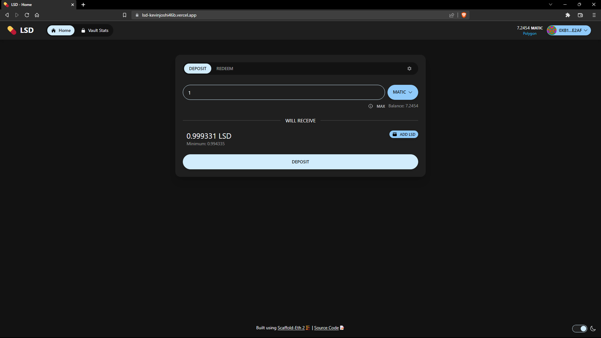
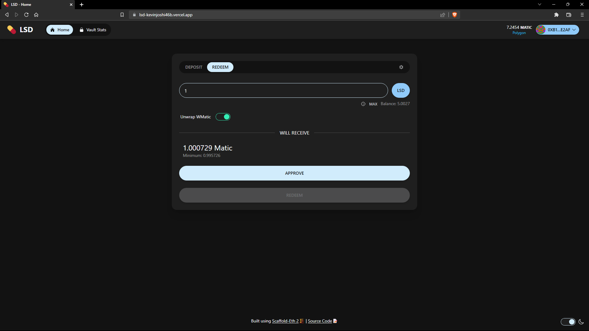
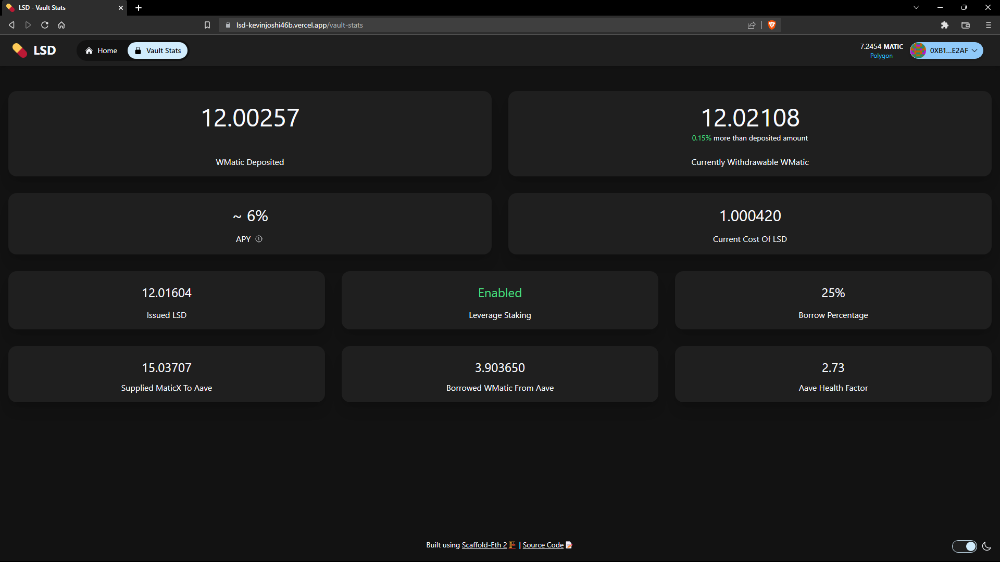
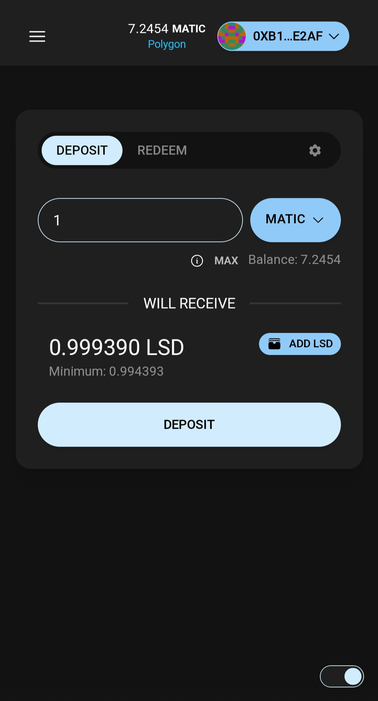
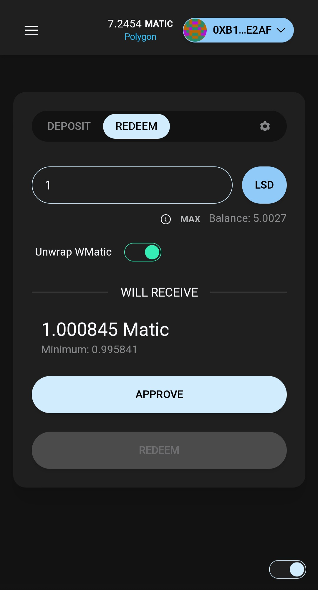
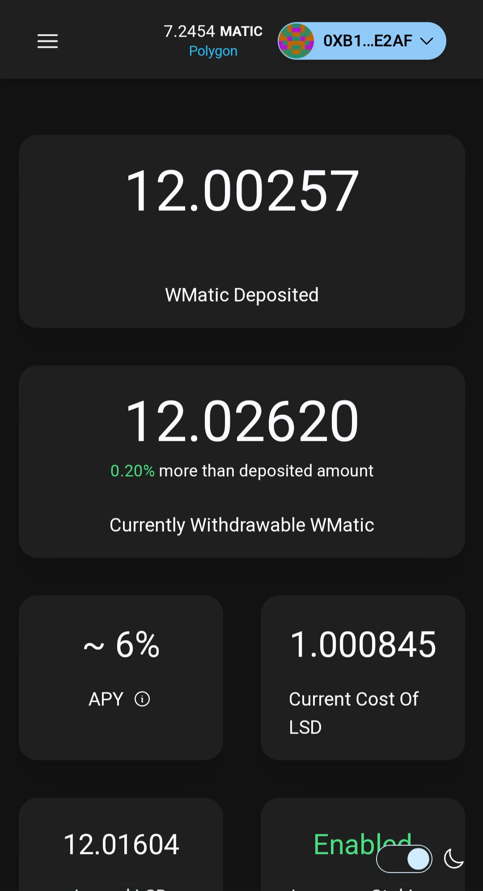
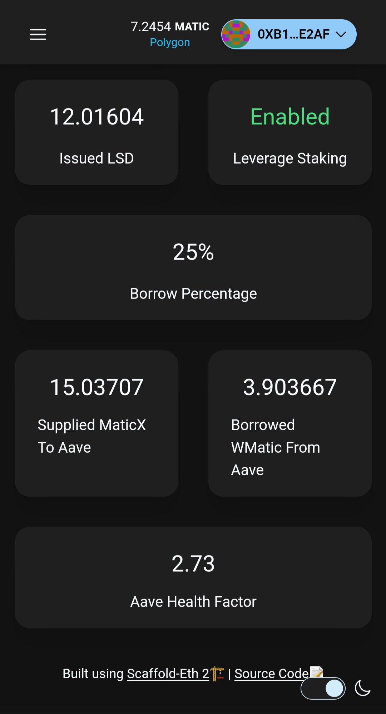

# LSD 💊

LSD is a liquid staking and leverage staking based yield generating vault. You can deposit your matic and receive LSD tokens which will appreciate in value w.r.t. matic over time 📈 LSD internally uses [Stader](https://www.staderlabs.com/), [Aave](https://aave.com/) & [Balancer](https://balancer.fi/) as well as the whole project is build using [scaffold-eth 2](https://github.com/scaffold-eth/se-2) 🏗️  
For more details here is a short video explanation: [Introducing LSD 💊](https://youtu.be/OZpSNxjCBVY)  

## Contracts

[LSD.sol](packages/hardhat/contracts/LSD.sol): This is the core ERC4626 based contract  
[LSDWrapper.sol](packages/hardhat/contracts/LSDWrapper.sol): This contract contains additional function for slippage and gateway (i.e. if user wishes to invest matic instead of wmatic or receive matic instead of wmatic they can use these gateway functions)

## Running this project

1. Clone the repository
2. Run the following command from the root of the project

```bash
yarn install
```

```bash
yarn start
```

> If you don't wish to interact with the polygon mainnet follow the steps below:

1. Clone the repository
2. In the [scaffold.config.ts](packages/nextjs/scaffold.config.ts) file change the `targetNetwork` property to `chains.hardhat`
3. Create .env file based on the .env.example file in [hardhat folder](packages/hardhat/)
4. Run the following command from the root of the project

```bash
yarn install
```

```bash
yarn fork
```

```bash
yarn start
```

## Images

### Desktop


---


---



### Mobile Devices

|  |  |  |  |
|---|---|---|---|
